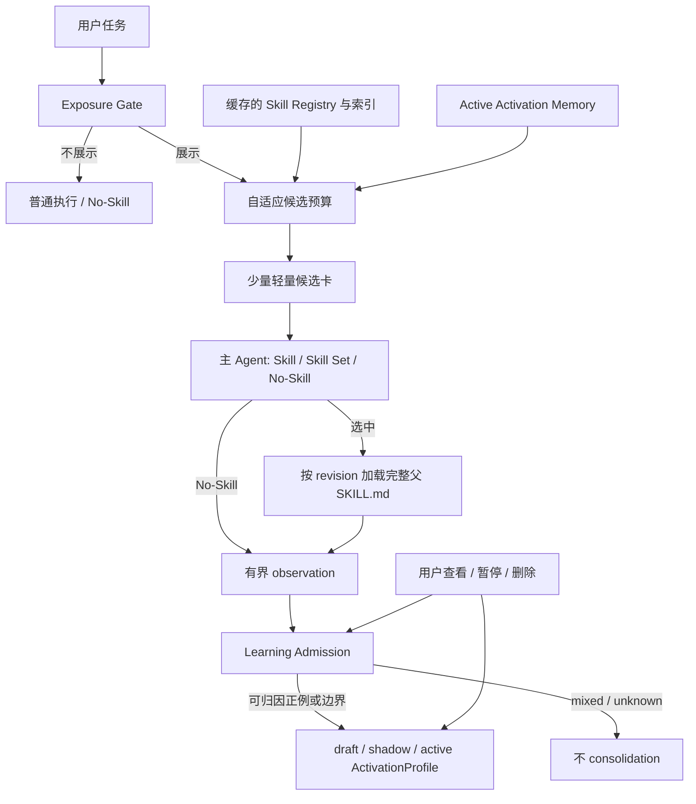

# Skill Cortex：低打扰 Skill Discovery 与可归因 Activation Memory

本项目当前研究：在不把完整 Skill catalog 常驻主 Agent 上下文、不增加 Router LLM 的前提下，
只在 Skill 有明显预期增益时展示最少候选，并且只从经过验证、可归因的真实使用中形成可撤销的
Activation Memory。

一句话原则：

> 少打扰 Agent、少塞上下文、只记真正有效或经过验证的边界经验。

## 当前范围

当前主线回答三个问题：

1. 这次是否需要向 Agent 展示任何 Skill？
2. 如果需要，最少展示哪些 Skill？
3. 哪些证据足以改善以后“什么时候使用该 Skill”的判断？

当前不把 Procedural Memory 作为主线。已有 `CompiledProcedure`、resolver、executor、promotion、
canary 和 lifecycle 代码保留为 **frozen experimental track**：不删除、不扩展、不接入当前入口，
也不计入当前完成标准。重新启用必须新增 ADR，并提供真实宿主质量、成本、维护和安全收益证据。

范围决定见 [ADR-0014](docs/adr/0014-activation-memory-first-scope.md)，完整设计见
[Activation-Memory-first 架构](docs/design/activation-memory-first-architecture.md)。

## 权威阅读顺序

### 当前主线

1. [AGENTS.md](AGENTS.md)：项目安全、范围和协作规则。
2. [最新实施进度审计](docs/reviews/2026-08-14-implementation-progress-audit.md)：已有实现证据；其中
   procedure phase 状态只说明历史 project-local 验证，不定义当前主线。
3. [ADR-0014：Activation-Memory-first 范围](docs/adr/0014-activation-memory-first-scope.md)。
4. [Activation-Memory-first 架构设计](docs/design/activation-memory-first-architecture.md)。
5. [ADR-0007：Prompt 外 Discovery](docs/adr/0007-prompt-external-skill-discovery.md)。
6. [ADR-0008：Practice Evidence](docs/adr/0008-practice-evidence-and-procedure-promotion.md)：当前只适用
   Practice Event、Activation evidence、污染、版本和删除规则；procedure 部分冻结。
7. [ADR-0013：Selection Memory Context](docs/adr/0013-selection-time-skill-memory-context.md)：目前仍是
   evaluation-only comparator，不代表生产接线。
8. [双记忆数据合同](docs/design/dual-memory-data-contracts.md)：SkillRecord、PracticeEvent 与
   ActivationProfile 继续适用；procedure/runtime 合同冻结兼容。

### 冻结实验方向

只有任务明确涉及已有 procedure 资产的审计、安全修复或历史解释时，才继续读取 ADR-0006、
ADR-0011、ADR-0012、旧双记忆实施计划和 Phase 3～5 报告。不得用这些材料启动新的 procedure
active path。

## 目标运行路径

三个 seam 必须独立：

- **Exposure Gate**：是否展示任何 Skill；
- **Candidate Budget**：展示多少、展示哪些；
- **Learning Admission**：哪些证据可以形成长期 Activation Memory。

不得用一个 maturity/confidence 总分同时控制三者。

## 当前证据边界

- prompt 外 Registry、BM25、Top-K 注入、Practice Store 和 ActivationProfile 链已有 project-local
  实现与测试证据；具体状态以最新 audit 和代码为准。
- Activation Memory calibration 只证明 positive lexical memory 能扩大召回，同时暴露严重
  No-Skill/hard-confuser 污染；它没有通过 promotion。
- Selection Memory held-out 支持候选已存在时的结构化 Memory Context，但 retrieval miss 仍是端到端
  瓶颈；该结果不证明真实 PracticeEvent formation、Pi host production 或自动 promotion。
- 当前 `.pi/extensions/skill-cortex/index.ts` 只接 discovery 与 Practice observer，没有启动 procedure
  execution，也没有因 ADR-0014 自动获得新的 exposure、control 或 cache 能力。

## 当前实施顺序

1. **D0 范围与文档**：ADR-0014、当前设计、旧文档 applicability 同步。
2. **D1 Learning Admission 与用户控制**：先阻止错误 consolidation，再提供 list/pause/resume/delete。
3. **D2 Exposure、No-Skill、自适应预算与轻量卡**：先 shadow，再按冻结 gate 决定是否 suppress。
4. **D3 Catalog/overlay cache**：Skill 库不变时零重建，变化时正确失效。
5. **D4 受控 active 验证**：分层关闭 admission、exposure、selection、control、cache 与 host E2E gate。

当前只完成 D0 设计，不得把设计合同表述为已实现能力。

## 不可突破的约束

- 原始 Skill package、作者 description、scope 和权限保持只读；派生资料不得覆盖。
- “任务完成”不等于 Skill 有贡献；positive Memory 必须有版本绑定的 contribution evidence。
- verified negative、near-miss 与 boundary evidence 可以保留，用于 No-Skill 与 hard-confuser 判断。
- `mixed`、`unknown`、evaluation、synthetic、来源不明或失效证据不能进入 active learning。
- 全量 catalog、完整 PracticeEvent 与完整 ActivationProfile 留在 prompt 外。
- 相关不等于必须使用；能直接可靠完成且 Skill 无明显增益时优先 No-Skill。
- 召回收益不能抵消 No-Skill、安全、隐私、删除或用户控制回归。
- 所有开发、数据和实验保持 project-local，不修改用户日常 Pi/Codex/Agent 环境或已安装 Skill。
