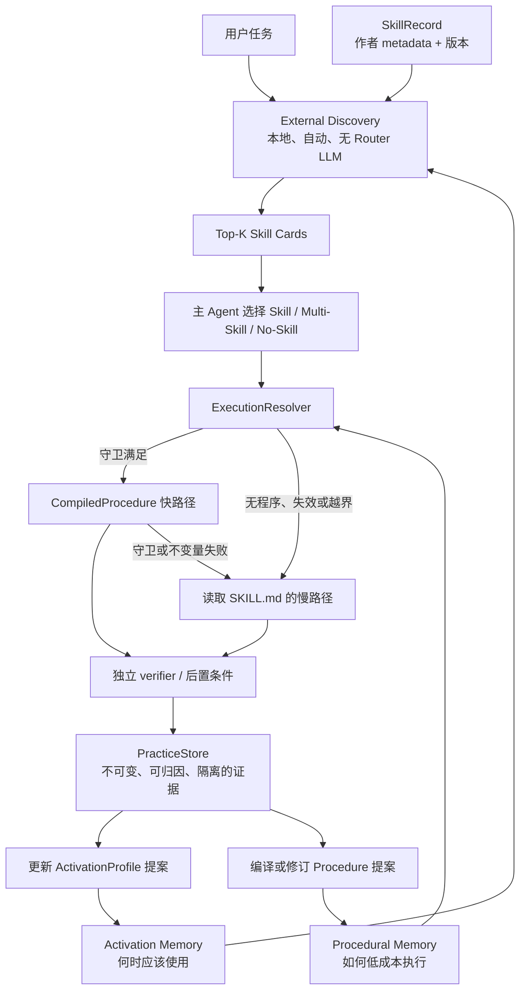

# Skill Cortex：已安装 Skill 的经验引导式熟练化

本项目研究两个相互连接、但职责分离的问题：

1. 不把全部 Skill metadata 常驻上下文时，Agent 如何发现相关的已安装 Skill。
2. Agent 如何在真实使用一个已安装 Skill 的过程中，把其中稳定、可验证的部分逐渐固化为程序快路径。

项目当前不研究“从自由任务轨迹自动创造全新 Skill”。核心对象始终是用户已经安装的 Skill；程序化产物是它的派生执行表示。

## 权威阅读顺序

1. [AGENTS.md](AGENTS.md)：所有 Agent 必须遵守的 project-local、安全和协作规则。
2. [最新实施进度审计](docs/reviews/2026-08-14-implementation-progress-audit.md)：当前真实阶段状态、未关闭 blocker 和下一轮 Herdr 的修复顺序。
3. [当前研究规范](docs/research/2026-08-14-experience-guided-installed-skill-proceduralization.md)：当前范围、研究问题和验收原则。
4. [ADR-0006：双记忆架构](docs/adr/0006-dual-memory-skill-architecture.md)：当前总体架构决定。
5. [ADR-0007：Prompt 外 Discovery](docs/adr/0007-prompt-external-skill-discovery.md)：当前发现机制决定。
6. [ADR-0008：证据与 Procedure 晋升](docs/adr/0008-practice-evidence-and-procedure-promotion.md)：当前学习、验证、失效和回退契约。
7. [双记忆数据合同](docs/design/dual-memory-data-contracts.md)：规范字段、不变量、状态机和数据所有权。
8. [多 Agent 实施计划](docs/plans/2026-08-14-dual-memory-implementation-plan.md)：Phase 0～7、所有权、gate、验证和停止条件。
9. [Phase 0：Pi 宿主 API 核验](docs/research/2026-08-14-phase0-pi-api-inventory.md)：当前安装版本允许与不可用的宿主接口。
10. [Phase 0：Project-local 基线与 Pilot](docs/research/2026-08-14-phase0-project-baseline.md)：技术栈、身份算法、数据政策和首个 pilot 决策。
11. [Phase 1 Gate P1 验收报告](docs/reports/2026-08-14-phase1-gate-report.md)：Registry、静态 discovery、shadow adapter、测试和限制。
12. [ADR-0009：Practice Store 事件文件与显式删除](docs/adr/0009-practice-store-event-files-and-deletion.md)：以不可变事件文件、claim 与 tombstone 落实原子身份和物理删除。
13. [Phase 2 Gate P2 验收报告](docs/reports/2026-08-14-phase2-gate-report.md)：Practice Store、policy、删除、回放、测试与风险边界。
14. [ADR-0005：Benchmark 数据边界](docs/adr/0005-benchmark-data-boundary.md)：仍有效的评测数据完整性规则，适用范围由 ADR-0007/0008 澄清。
15. [相关工作与新颖性边界](docs/research/2026-08-14-skill-cortex-related-work.md)：哪些机制已有先行工作，哪些仍只是待验证假设。
16. [对抗性架构审查](docs/reviews/2026-08-14-skill-cortex-audit.md)：安全、归因、版本、回退和评测风险；其中 routing-only 阶段决定已经失效。

[旧版“从轨迹学习新技能”讨论稿](docs/research/2026-08-14-learning-skills-into-programs.md)仅用于追溯项目纠偏过程，不再定义当前范围。

## 双记忆架构

两种记忆不能混为一个分数：

- **Activation Memory** 改善“什么时候应当选择父 Skill”。
- **Procedural Memory** 改善“父 Skill 被选中后，哪些步骤可以少用 LLM”。
- 使用频率、成熟度和 procedure 数量不得直接提高 Skill 的 discovery 相关性。
- `CompiledProcedure` 不注册为独立 Skill，避免候选爆炸和父子语义漂移。

## 当前阶段

当前状态以[最新实施进度审计](docs/reviews/2026-08-14-implementation-progress-audit.md)为准：Phase 0 complete；Phase 1、Phase 2 与 Phase 3 均已通过对应 gate；Phase 3 procedure 达到 `validated`；Phase 4 component complete（host integration 未接线）；Phase 5～7 未开始。component、host integration 与 end-to-end 必须分别验收。

Phase 3 procedure 已正式晋升至 `validated`（Gate P3 闭环）：2 条真实、可归因、policy-valid 的 pagination PracticeEvent 经 induction seam 绑定 evidenceIds，held-out 质量门全过，真实成本复测 `N_break-even=0.000109 ≤ 10`。`validated ≠ active`：进入 canary/active 前须先过 shadow replay + canary gate（ADR-0008）。Phase 4 Execution Resolver 已实现 component 层（resolveExecution/guard/fallback/executor/canary），host integration 未接线。证据见 [Phase 3 Gate 报告](docs/reports/2026-08-14-phase3-gate-report.md)、[P3 validation report](docs/reports/2026-08-14-phase3-p3-validation-report.json)与 [Phase 4 Resolver Gate 报告](docs/reports/2026-08-14-phase4-resolver-gate.md)。

Phase 0 已冻结：

- `SkillRecord`、`ActivationProfile`、`PracticeEvent`、`CompiledProcedure` 和 `ExecutionDecision` 的最小合同；
- prompt 外、自动、无额外 LLM 的本地 discovery 边界；
- 版本失效、权限继承、独立验证和安全回退规则；
- Phase 3 pilot 已由 ADR-0010 改为 `supabase-postgres-best-practices` 的只读 SQL pagination 静态检测；installed Skill 保持只读，仓库只保存 provenance、完整哈希和项目原创评测案例。Phase 2 的 synthetic `docx` replay 仅保留为历史 Practice Store 证据。

Phase 2 只建立 append-only、脱敏、隔离且可删除的 Practice Store；没有可信 Practice Store 之前，不允许自动编译、调权或进入程序快路径。

## ADR 状态

| ADR | 当前地位 | 仍可复用的内容 |
|---|---|---|
| [ADR-0006](docs/adr/0006-dual-memory-skill-architecture.md) | **当前有效** | Installed Skill 语义来源、双记忆、Practice Store、ExecutionResolver |
| [ADR-0007](docs/adr/0007-prompt-external-skill-discovery.md) | **当前有效** | prompt 外自动 Top-K、无 Router LLM、候选卡、补搜与安全隔离 |
| [ADR-0008](docs/adr/0008-practice-evidence-and-procedure-promotion.md) | **当前有效** | Practice Evidence、双记忆更新、Procedure 晋升、失效和回退 |
| [ADR-0005](docs/adr/0005-benchmark-data-boundary.md) | **Accepted**，scope 由 ADR-0007/0008 澄清 | 人工 Gold、真实 shadow observation 与 synthetic stress 的证据隔离 |
| [ADR-0001](docs/adr/0001-routing-only-mvp.md) | 历史，已被 ADR-0006 替代 | routing-only 方案演化记录 |
| [ADR-0002](docs/adr/0002-general-core-pi-shadow.md) | 历史，已被 ADR-0006/0007 替代 | 通用核心、adapter 和 shadow 思路的来源记录 |
| [ADR-0003](docs/adr/0003-shadow-local-retriever.md) | 历史，已被 ADR-0007 替代 | 本地检索方案与替代项分析的来源记录 |
| [ADR-0004](docs/adr/0004-promotion-principle.md) | 历史，相关 scope 已被 ADR-0007/0008 替代 | 成本与质量硬门槛的来源记录 |

范围说明以[当前研究规范](docs/research/2026-08-14-experience-guided-installed-skill-proceduralization.md)为准；具体架构决策以 ADR-0006～0008 为准。

## 不可突破的约束

- 作者提供的原始 Skill 文件与 metadata 保持不可变；学习结果只写入派生层。
- 熟练度不得扩大权限。删除、发送、付款、凭据等动作始终经过独立 authorization gate。
- Skill source、工具 schema、权限或相关环境变化后，受影响的 procedure 必须失效。
- 守卫、前置条件或结果不变量失败时，立即停止快路径并回退原始 `SKILL.md` 慢路径。
- 评测轨迹、秘密和未经归因的成功不得进入学习数据。
- 任何新颖性表述都必须先经过完整文献、产品、专利检索和逐项 claim chart。
