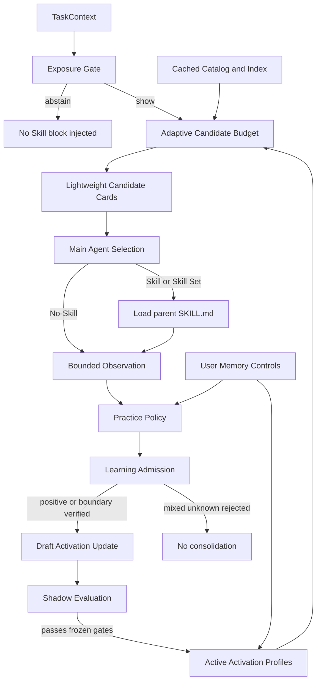

# Activation-Memory-first 架构设计

状态：Accepted design — 2026-08-22  
权威范围：ADR-0014  
实现状态：D0 完成；D1 控制切片已实现但可信 contribution verifier 仍缺失；D2 Exposure shadow observation 已接真实入口

## 1. 目标

系统在每次主 Agent 推理前只做足够少的工作，回答：

1. 是否值得展示任何已安装 Skill；
2. 如果值得，最少展示哪些候选；
3. 哪些真实经验足以改善以后“什么时候使用该 Skill”的判断。

目标不是最大化 Skill 调用率，而是在必要 Skill 的召回不退化前提下，最小化无意义候选、上下文、
索引重建和错误学习。

## 2. 非目标

- 不在当前主线生成、晋升或执行 `CompiledProcedure`；
- 不增加 Router LLM、Ability/category 硬门或全量 metadata prompt；
- 不从自由轨迹创造新 Skill；
- 不把任务完成、Skill 被选择、Skill 被加载或 verifier pass 单独当作贡献证明；
- 不把完整 PracticeEvent、ActivationProfile、用户任务或工具输出注入模型；
- 不修改用户已安装 Skill package。

## 3. 总体数据流



完整 catalog、索引、Practice evidence 和 ActivationProfile 均留在 prompt 外。只有 Exposure Gate
批准后的轻量候选卡，以及必要时极短的候选绑定 hint，进入 Agent 上下文。

## 4. 核心 module 与 seam

以下是平台无关的逻辑 interface，不是已经验证的 Pi interface 名称。宿主 adapter 只能映射当前
安装版本真实存在的事件和工具；不得按本设计发明 hook。

### 4.1 Catalog Cache module

职责：隐藏 Skill 扫描、revision、manifest、索引构建与缓存失效复杂度。

```ts
interface CatalogSnapshot {
  catalogRevision: string;
  records: readonly SkillRecord[];
  index: DiscoveryIndex;
  cacheDisposition: "hit" | "partial_rebuild" | "full_rebuild";
}

interface CatalogCache {
  getSnapshot(hostSkills: unknown): Promise<CatalogSnapshot>;
  invalidate(reason: "host_change" | "source_change" | "manual"): Promise<void>;
}
```

不变量：

- Skill 库未变化时复用同一 snapshot，不逐轮重建完整 index；
- 变化检测必须绑定实际 catalog/source revision，不能用 TTL 冒充正确性；
- cache miss 或损坏可以重建；不得回退为全量 metadata 注入；
- `load_skill` 仍在加载时独立检查 revision/source drift，不能只信缓存。

### 4.2 Exposure Gate module

职责：为“是否向 Agent 展示候选”提供一个可观察、可替换的 seam；不选择具体 Skill，不晋升 Memory，
也不判断任务属于翻译、改写、聊天或其他手写类别。

```ts
interface ExposureObservation {
  baselineWouldInject: boolean;
  candidateCount: number;
  topScore?: number;
  secondScore?: number;
  topMatchFields: readonly ("name" | "description" | "alias" | "learned_cue")[];
  exactDeclaredReference: boolean;
}
```

持久化记录在上述字段外只增加 `schemaVersion`、`routeDecisionId`、tenant、时间与最终合法
`selectedSkillIds`。它不保存任务原文，也不返回 active decision；`routeDecisionId` 与 PracticeEvent
使用同一真实 run 标识，使有 Skill 与 No-Skill 两类选择都可审计。

第一版是 **shadow-only**：只产生 observation，不返回 active `show/abstain` 决策，不改变当前 bounded
候选注入行为。它的目标是收集能否安全 abstain 的证据，而不是先发明一个任务分类器。

第一版约束：

- 不维护任务类型列表、关键词规则表、正则分类器或“简单/复杂”标签；
- 不计算 `expected_gain`，不把模型能力、任务难度或 Skill 必要性伪装成可确定计算的字段；
- 只观察 retriever 已产生的结构化事实，不重新解析用户任务语义；
- `exactDeclaredReference` 只允许精确匹配当前 catalog 中的 Skill name、ID 或作者声明 alias；不能扩展为
  同义词/意图规则，也不能把模糊词命中解释为用户显式要求；
- retriever 为空时 baseline 本来就不注入候选；retriever 非空时仍保持当前行为，直到 frozen shadow
  evidence 支持一个简单的 active policy；
- `search_skills` 补搜始终保留，不依赖 Gate 主动猜测。

当前第一切片已实现纯 `observeExposure` 投影、project-local append-only tenant 分区 Store，以及真实
Pi discovery snapshot → observer settled 接线。生产入口在 learning enabled 时记录 Skill/No-Skill 两类
run；pause 时不创建记录。当前仍沿用 bounded inject baseline，没有 suppress、任务分类器、Router LLM、
`expected_gain` 或 active Gate policy，因此只能报告 D2 Exposure observation component + host integration，
不能报告 G2 或 active Exposure 完成。

未来 active policy 的上限也应保持很小，例如只读取候选集合、匹配字段、分数/分差和精确声明引用。
如果必须增加任务类型词典、几十条规则或额外 Router LLM 才能过门，应判定 Gate 假设失败，继续使用
shadow + bounded cards，而不是扩大分类器。

### 4.3 Candidate Budget module

职责：在 exposure=`show` 后选择最小充分候选集合。

```ts
interface CandidateBudgetDecision {
  candidates: readonly SkillCandidate[];
  budget: 1 | 2 | 3 | 5;
  reason: "dominant" | "complementary_intents" | "ambiguous" | "diagnostic_fallback";
}
```

以下预算策略是待验证假设，不是第一版 active 行为。第一版同时在 shadow 中比较 K=1/2/3/5，
不在看到独立评估前改变当前默认 K：

- 单一高置信意图：1 个；
- 有证据的互补多意图：每个必要意图保留候选，总量通常 2～3 个；
- hard-confuser 且无法安全缩减：最多 3 个，并允许 bounded hint；
- 5 个只用于显式补搜、诊断或冻结 comparator，不作为每轮默认；
- 不允许用固定 Top-1 换取低 token，因为这会破坏 multi-skill full-set recall；
- 候选合并必须有全局上限，并报告被预算挤出的 Gold/互补意图。

当前已实现 K=1/2/3/5 的确定性前缀 comparator，并随同一 `routeDecisionId` 的 Exposure record
持久化各臂 candidate Skill IDs。它不输出推荐预算或 reason；即使生产 `topK=1`，也只在旁路读取
最多 5 个候选用于观察，生产返回仍保持 1 个。没有独立 Gold/Selection 评估前不得据此改变预算。

### 4.4 Candidate Presentation module

Level 1 卡片的最小模型可见形状：

```ts
interface LightweightSkillCard {
  skillId: string;
  skillRevision: string;
  name: string;
  displayDescription: string;
  activationHint?: {
    useWhen?: string;
    avoidWhen?: string;
  };
}
```

规则：

- `displayDescription` 优先使用作者 description 的有界、确定性投影；若压缩需要生成新语义，必须作为
  派生字段保存 provenance，并经过离线可区分性验证，不能覆盖作者 description；
- `skillId + skillRevision` 是 load handle，不因视觉轻量化而省略；
- scope、环境或不可用原因只有在影响当次判断时展示；retrieval score、evidence ID、完整 Memory 和
  source path 不进入卡片；
- `activationHint` 默认省略，只在 ambiguity policy 触发时加入，每个候选最多一条 `useWhen` 和一条
  `avoidWhen`，且受独立字符预算约束；
- Agent 选中后才通过现有 fail-closed 加载 seam 读取完整 `SKILL.md`。

当前轻量卡切片仅在 shadow 中比较作者 description 的 120/240/480 UTF-16 字符投影，记录每臂总字符
数与被截断候选数；生产候选卡仍使用现有作者 description，不注入投影，不生成 `activationHint`。
这些长度只是并行实验臂，不是发布阈值；需要 G3 的 multi-skill/hard-confuser/字符成本证据后才能选择。

### 4.5 Learning Admission module

职责：把 observation 分类为可学习正例、可学习边界或不可 consolidation，隐藏 attribution、版本、
provenance、隐私与删除检查。

```ts
interface LearningAdmissionDecision {
  decision: "positive" | "boundary" | "reject";
  taskOutcome: "verified_success" | "verified_failure" | "unknown";
  skillContribution: "verified" | "disproved" | "mixed" | "unknown";
  reason: string;
  evidenceIds: readonly string[];
}
```

第一切片冻结以下最小独立评估形状；它与 append-only `PracticeEvent` 分开，避免事件中的任务结果或
caller 自报 attribution 直接成为学习许可：

```ts
interface LearningEvidenceAssessment {
  schemaVersion: 1;
  assessmentId: string;
  eventId: string;
  tenantScope: string;
  parentSkillId: string;
  parentSkillRevision: string;
  sourceHash: string;
  taskOutcome: "verified_success" | "verified_failure" | "unknown";
  skillContribution: "verified" | "disproved" | "mixed" | "unknown";
  evidenceKind: "positive" | "near_miss" | "boundary" | "external_failure";
  verifier: {
    kind: "independent_verifier" | "user_confirmation";
    result: "pass" | "fail" | "unknown";
  };
  assessedAt: string;
}
```

当前 component 规则：assessment 必须通过 verifier，并精确绑定 event、父 Skill revision 与 source；
positive 还必须同时满足真实事件、父 Skill 被候选和选中、`skill_md` 路径、verified task success 与
verified contribution。near-miss/boundary 必须有明确的 disproved contribution 与结构化边界；
环境、工具、权限、用户中断等外部失败只作 observation。`mixed/unknown`、evaluation/synthetic、
compiled-procedure evidence 或缺 assessment 一律 reject。

assessment 已由 project-local append-only Store 持久化：tenant 使用 hash 目录隔离，assessmentId 与
eventId 在 tenant 内不可覆盖，写入前必须绑定 Practice Store 中已经存在的 real `skill_md` event，读取
损坏 fail closed。host induction 只按 `tenantScope + eventId` 从 Store/read seam 取 assessment，不接收
caller 临时数组或 Map。

本切片尚未提供可信真实宿主 contribution verifier。当前隔离 ExtensionRunner 验收证明“load + result
verifier pass 但 Store 中缺独立贡献 assessment ⇒ 零 ActivationProfile”；因此这里只能报告 Admission
component、assessment persistence、用户控制与 host fail-closed seam，不能报告 G1 或 D1 end-to-end complete。

准入矩阵：

| Task outcome | Skill contribution | 处理 |
|---|---|---|
| verified success | verified | positive proposal |
| verified success | mixed/unknown | reject consolidation |
| verified failure | verified boundary/near-miss | boundary proposal |
| verified failure | external/tool/environment only | observation only |
| unknown | 任意 | reject consolidation |

贡献验证至少要能确认：父 Skill/revision、实际暴露与选择、实际加载或执行表示、Skill 特定步骤/结果
与 verifier 的关系，以及其他 Skill、基础模型、人工干预和外部失败没有被误记为该 Skill 的贡献。
无法建立此链时保持 `mixed/unknown`。

### 4.6 Memory Control module

用户控制 interface 保持小而明确：

```ts
interface MemoryControl {
  status(): Promise<LearningStatus>;
  list(options?: { skillId?: string }): Promise<readonly MemorySummary[]>;
  setLearning(enabled: boolean): Promise<void>;
  forget(target: { evidenceId?: string; profileId?: string }): Promise<ForgetResult>;
}
```

语义：

- `setLearning(false)` 后不得持久化新的 PracticeEvent，也不得 induction/promotion；已有 active profile
  是否继续影响 discovery 必须在 status 中明确，第一版默认继续生效；
- `forget(evidenceId)` 物理删除/失效 evidence，并级联 suspend 或重建依赖 cue；
- `forget(profileId)` 必须停止该 profile 的 active 影响，并按产品策略删除或 tombstone 派生资料；不得
  删除原始 Skill；
- 返回内容只包含脱敏摘要、状态、父 Skill 身份、cue 数量和 evidence 引用，不返回完整用户任务；
- 控制失败必须 fail closed，不能只改 UI 状态而继续后台学习。

当前实现把控制状态持久化在 project-local tenant-hash 分区，并通过真实 Pi 工具暴露
`skill_memory_status`、`skill_memory_set_learning`、`skill_memory_list` 与 `skill_memory_forget`。observer
在摄入前和落盘前双重检查 pause，host lifecycle 在 pause 时不 induction/promotion；静态 discovery 与
已有 active overlay 继续生效并由 status 明示。evidence forget 同时失效 PracticeEvent/assessment 并级联
suspend 依赖 profile；profile forget 进入不可恢复的 retired tombstone。隔离 ExtensionRunner 已验证工具
注册、pause 重启持久化、零新增 evidence、脱敏 list 和 profile forget；组件测试验证 evidence 级联。

## 5. No-Skill 合同

注入给主 Agent 的指导应表达以下语义，而不是只说“没有候选时可不选”：

> 候选相关不等于必须使用。若任务可直接、可靠地完成，且 Skill 不会明显提高质量、安全、必要工具
> 流程或用户明确要求的遵循度，优先 No-Skill。不要为了使用候选而调用 Skill。

No-Skill 在三个 seam 分别可发生：

1. Exposure Gate abstain：完全不展示 Skill；
2. 候选预算后为空：不注入空候选区块；
3. Agent Selection 返回 No-Skill：即使候选相关，也判断没有足够增益。

三者必须分栏观测，不能合并成一个 No-Skill accuracy。

## 6. ActivationProfile 生命周期

沿用现有状态思想，但当前主线只保留：

```text
observation
  -> admission reject
  -> draft -> shadow -> active -> suspended -> retired
                    ^         |
                    +---------+ revalidate
```

- `draft`：已通过准入、尚未影响检索；
- `shadow`：计算 exposure/retrieval/selection 影响，但不改变 Agent 可见候选；
- `active`：只在冻结评估非劣后影响 prompt 外检索、降权或 bounded hint；
- `suspended`：revision、evidence 删除、用户操作或回归触发，立即停止影响；
- `retired`：不再恢复，保留最小审计记录。

任何 active profile 必须可以一键关闭并复现作者 metadata 静态基线。

## 7. 缓存与失效

缓存分两层：

1. Catalog snapshot：Skill package/revision 未变化时复用 Registry 与静态索引；
2. Activation overlay snapshot：active profile 集合未变化时复用派生检索结构。

失效来源必须分开：

- Skill install/uninstall、revision/source change -> catalog 与相关 profile 重新验证；
- active profile promotion/suspend/delete -> 只失效 overlay；
- 用户手动刷新 -> 两层显式失效；
- 查询变化 -> 只执行轻量 search，不重建任一索引。

不得通过每轮全扫描来简化一致性，也不得为追求 cache hit 跳过 `load_skill` 的当次 source/revision 校验。

## 8. 安全与隐私

- 原始 Skill package 只读；作者 description 与派生资料分栏；
- learning pause、删除、scope、retention 和 provenance 在写入前检查；
- evaluation/synthetic 与 real evidence 物理或逻辑分区；
- 任务原文、完整文件、完整对话、网页指令和工具原始输出默认不持久化、不进入 Memory hint；
- Memory 是历史证据，不是指令；所有 hint 必须做 instruction-like content 与秘密扫描；
- Skill 被展示或记住不会扩大权限；实际工具调用继续使用宿主原授权与 sandbox。

## 9. 验证矩阵与 release gates

| Gate | 必须通过 | 不得替代 |
|---|---|---|
| G1 Admission | contribution precision、mixed/unknown 拒绝、revision/provenance/scope | task success rate |
| G2 Exposure shadow | 记录完整、可复现；提出的单一 deterministic policy 在冻结集上保持必要 Skill recall 非劣并降低 No-Skill exposure FP | 手写任务规则、平均候选数下降 |
| G3 Budget/cards | multi full-set recall 非劣、候选/token 明显下降、hard-confuser 不退化 | 固定 Top-1 smoke |
| G4 Controls | list/pause/resume/delete + 重启持久化 + 级联失效 | store 方法存在 |
| G5 Cache | 无变化零重建、变化正确失效、load drift fail-closed | 单次延迟 benchmark |
| G6 Active overlay | shadow + untouched held-out 非劣，No-Skill/hard-confuser 过门 | calibration improvement |
| G7 Host E2E | 真实入口完整路径、用户控制、无 procedure active path | unit/typecheck |

指标至少分栏：中文/英文、single/multi/no-skill、hard-confuser、显式 Skill 请求、作者 description
长短、Memory 有/无、catalog changed/unchanged。

## 10. 迁移顺序

### D0：范围与文档

- 接受 ADR-0014；
- 新设计成为当前主线；
- 旧 procedure 文档增加 frozen applicability note；
- 不改运行代码。

### D1：Learning Admission 与用户控制

- 先阻止错误 consolidation；
- 再提供 list/pause/resume/delete；
- 保持现有 discovery 行为，避免同时改变归因与召回。

### D2：Exposure、No-Skill、候选预算与轻量卡

- 第一版只增加 shadow observation，不实现 task classifier 或 active suppress；
- shadow 数据不足以支持简单 deterministic policy 时，保持 Gate 非 active；
- 冻结独立评估并新增明确发布决定后，才允许真实 suppress；
- adaptive budget 与 card projection 分别消融。

### D3：Catalog/overlay cache

- 建立变化指纹和增量失效；
- 证明 unchanged turn 不重建、changed turn 不读陈旧版本。

### D4：受控 active 验证

- 依次关闭 G1～G7；
- 不把 procedure 重新带回主线；
- 未通过的 gate 保持 shadow 或静态 baseline。

## 11. Frozen Procedural Track

以下现有模块保持冻结，不属于 D1～D4：

- `src/procedures/`；
- `src/runtime/` 中 procedure resolver/executor 路径；
- `src/adapters/pi/execution-adapter.ts`；
- Phase 3～5 procedure promotion、canary、lifecycle 与成本评测；
- ADR-0011/0012 的 procedure safety/release 合同。

它们可以继续通过现有测试防止腐化，但不得接入当前 project-local 主入口，不得作为
Activation-Memory-first 完成证据。未来重新启用必须满足 ADR-0014 的 re-entry evidence，而不是
仅凭已有代码、绿色测试或离线 break-even。

保留源码不等于允许它进入 Pi 插件运行时。当前 `.pi/extensions/skill-cortex/index.ts` 的静态 import
路径没有触达 `src/procedures/`、`src/runtime/` 或 `src/adapters/pi/execution-adapter.ts`，且没有注册
procedure tool；Practice observer 中可选的 compiled-evidence seam 也未由当前入口配置。最终自用发布前
必须增加并通过以下隔离门：

- 从真实插件 entry 出发的静态 import reachability 不得触达 frozen procedure/runtime 模块；
- 实际注册的工具和事件 handler 清单不得包含 procedure execution adapter/tool；
- compiled-evidence observer 配置必须保持 absent；
- 隔离失败时阻止插件发布，而不是依赖“理论上不会调用”。

只要这些门成立，procedure 文件可以保留在同一仓库，代价主要是 typecheck、测试与安全审计维护面，
不是运行时行为。若以后维护成本持续出现，才考虑把 frozen track 移到独立 package/archive；当前无需
为了自用 Pi 插件先做物理删除。

## 12. 待实施前冻结的问题

1. Exposure shadow 是否能支持一个无需任务分类规则的 deterministic active policy；若不能，是否永久保持 shadow；
2. `displayDescription` 是作者文本截断、抽取还是带 provenance 的独立摘要；
3. ambiguity hint 的触发条件和字符预算；
4. contribution verifier 的最小可验证形状与人工复核入口；
5. learning pause 是否需要第二个“停用已有 active Memory”开关；
6. profile-level forget 的物理删除、tombstone 与审计保留语义；
7. catalog change fingerprint 如何在 Windows 上兼顾正确性与低扫描成本。

这些问题必须在对应实施阶段冻结测试与失败语义；本设计不以未验证假设冒充宿主能力。
